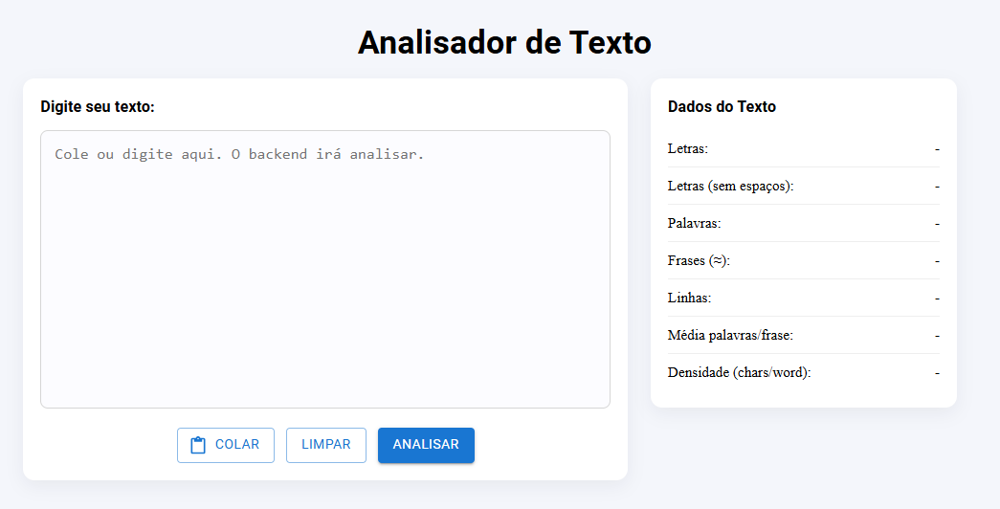

# 📝 Text Analyzer - Frontend

<p align="center">
  <a href="https://dss-text-analyzer-frontend.vercel.app/" target="_blank">
    
  </a>
</p>


> Plataforma simples, moderna e responsiva para análise de textos, desenvolvida com React, TypeScript, Styled Components e Material UI, integrada a um backend em Python para processamento dos dados.

🔗 **Acesse online:** [https://dss-text-analyzer-frontend.vercel.app/](https://dss-text-analyzer-frontend.vercel.app/)

---

## 🚀 Tecnologias Utilizadas

Este projeto foi construído com as seguintes tecnologias:

- ⚛️ [React 19](https://react.dev/)
- 🌀 React DOM
- 🎨 [Material UI](https://mui.com/)
- 💅 [Emotion](https://emotion.sh/docs/styled)
- 🧵 [styled-components](https://styled-components.com/)
- 📡 [Axios](https://axios-http.com/)
- 💎 [TypeScript](https://www.typescriptlang.org/)
- ⚡ [Vite](https://vitejs.dev/) — para desenvolvimento rápido
- 🧹 ESLint + TypeScript ESLint — para padronização do código
- 🔌 @vitejs/plugin-react — integração do React com Vite


---
## 📁 Estrutura do Projeto
```
dss-text-analyzer-frontend/
│
├── public/
│ ├── banner-readme.png
├── src/
│ ├── App.tsx
│ ├── main.tsx
├── .gitignore
├── eslint.config.js
├── index.html
├── package.json
├── tsconfig.json
└── README.md
```
## 🐍 Projeto BACKEND

https://github.com/delberss/dss-text-analyzer-backend

---

## 🖥️ Como Rodar Localmente

### 1️⃣ Clone o repositório

```bash
git clone https://github.com/delberss/dss-text-analyzer-frontend
```
### 2️⃣ Acesse a pasta do projeto
```bash
cd dss-text-analyzer-frontend
```
### 3️⃣ Instale as dependências

```bash
npm install
```

### 4️⃣ Crie o arquivo `.env`

```bash
Na raiz do projeto, crie o arquivo: .env
```
### 5️⃣ Configure a URL do backend

```bash
VITE_API_URL=http://localhost:8000
```
### 6️⃣ Execute o projeto
```bash
npm run dev
```
### 7️⃣ Abra no navegador
```bash
http://localhost:5173
```